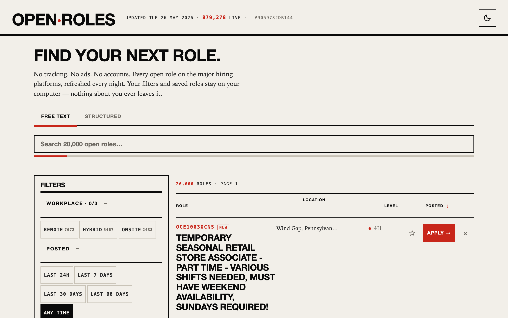
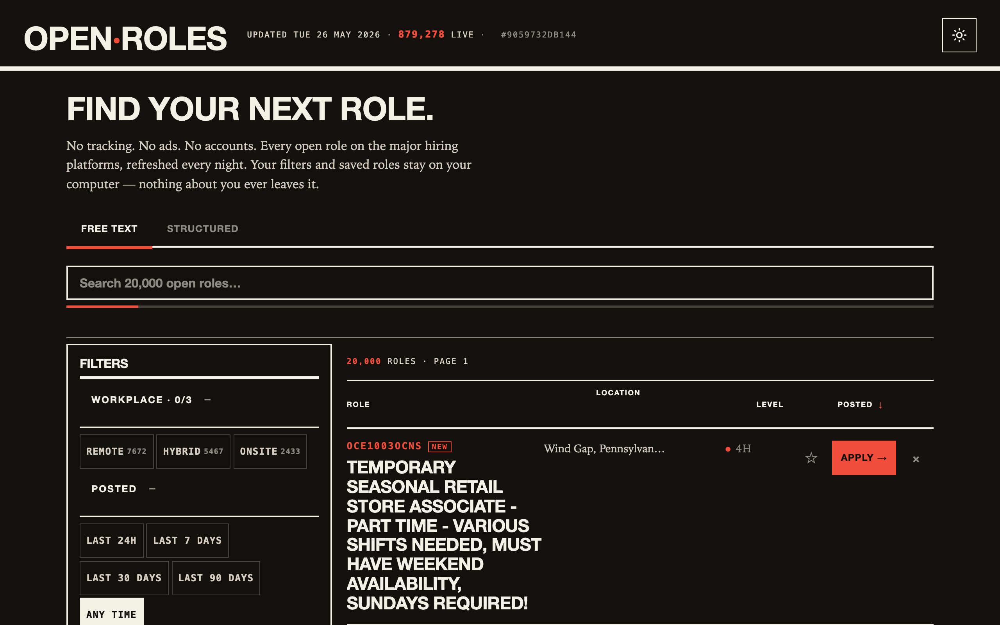
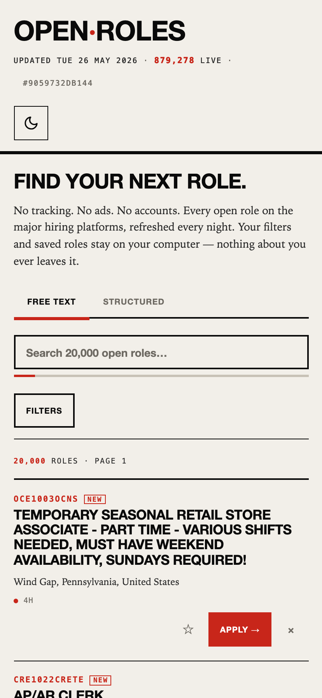

# openroles

**A daily-refreshed, privacy-respecting job board across 36 applicant tracking systems. No accounts. No ads. No tracking. Static HTML and gzipped JSON, served from GitHub Pages — filtered in your browser, cached for instant revisits.**

[](https://github.com/datascry/openroles/actions/workflows/build-deploy.yml)
[](https://github.com/datascry/openroles/actions/workflows/scrape.yml)
[](https://github.com/datascry/openroles/actions/workflows/pr.yml)
[](https://openroles.today/)
[](https://openroles.today/)
[](LICENSE)
[](LICENSE-DATA)
[](https://github.com/datascry/openroles/stargazers)

[](https://openroles.today/)

<details>
<summary><strong>Dark mode &amp; mobile</strong></summary>

<p>
  
</p>

<p>
  
</p>

</details>

> [!NOTE]
> Live at **https://openroles.today/**.
> Refreshed every night.

## What it is

`openroles` scrapes the public APIs of 32 hiring platforms each
night, normalises the postings into a shared schema, and ships them
to your browser as a set of content-hashed JSON.gz chunks. Filter,
sort, search, and pagination all run client-side over the in-memory
dataset — once the chunks have loaded, every interaction is instant
and works offline.

Apply links go directly to the source ATS. Saved roles, applied
roles, ignored roles, saved searches, and your theme preference live
in `localStorage` on your device — nothing about you ever leaves the
browser. The masthead, hero, and first 50 rows are pre-rendered HTML
so first paint never waits on JavaScript.

## Try it

Every filter is in the URL — bookmark a query, share it, embed it in
a Notion page. No login required for any of these.

| Query | URL |
|---|---|
| Senior + staff engineers on Greenhouse or Lever, remote-only, last 7 days | [`?ats=greenhouse,lever&level=senior,staff&wt=remote&since=7d`](https://openroles.today/?ats=greenhouse,lever&level=senior,staff&wt=remote&since=7d) |
| "Staff engineer" anywhere in the title, Germany only | [`?q=title:"staff engineer"&country=DE`](https://openroles.today/?q=title%3A%22staff+engineer%22&country=DE) |
| Stripe, all roles | [`?q=company:stripe`](https://openroles.today/?q=company%3Astripe) |
| Hide recruiter posts + hide stale carry-forwards | [`?recruiter=0&hide_stale=1`](https://openroles.today/?recruiter=0&hide_stale=1) |

The URL DSL is documented in [`specs/filter-ui.md`](specs/filter-ui.md);
the parser is property-tested in
[`site/src/lib/search-dsl.test.ts`](site/src/lib/search-dsl.test.ts).

## How it works

```
Common Crawl  ──►  weekly-harvest.yml  ──►  data/tenants/{ats}.json
                                                    │
                                                    ▼
ATS public APIs ──►  scrape.yml (nightly)  ──►  data/scrape-outputs/*
                                                    │
                                                    ▼
                              build-deploy.yml  ──►  jobs.{sha}.sqlite (build-time)
                                                    │
                                                    ▼
                              slim-index emitter  ──►  data/slim/*.json.gz
                                                    │
                                                    ▼
                              Astro static build  ──►  GitHub Pages
                                                    │
                                                    ▼
                                                 Browser
                                            (Web Worker decodes
                                             slim-index chunks,
                                             FilterTable runs
                                             everything in memory)
```

The build-time SQLite is scaffolding only — it isn't deployed. What
ships to the browser is a few dozen content-hashed JSON.gz chunks
(~50 MB total today, growing with the corpus) plus a `manifest.json`.
A Service Worker caches the gzipped bytes; the merged dataset is
further cached in IndexedDB keyed by the build sha, so warm reloads
restore in ~100 ms and skip the chunk pipeline entirely.

See [ARCHITECTURE.md](ARCHITECTURE.md) for the full system shape and
[`docs/adr/`](docs/adr/) for the locked architectural decisions.

## Coverage

Thirty-six ATSes. The multi-tenant set, weighted by tenant volume in
the public Common Crawl index:

```
Greenhouse · Lever · Ashby · BambooHR · Workday · iCIMS · Recruitee
Breezy · Personio · Workable · Teamtailor · SmartRecruiters · CSOD
Taleo · UltiPro · Jobvite · Zoho Recruit · Talentlyft · Pinpoint HQ
ApplicantPro · ApplicantStack · Homerun · Factorial · Eightfold
SuccessFactors · BrassRing · Oracle HCM Cloud · JazzHR · Phenom
HRMDirect
```

Plus two vendor-agnostic harvesters and four per-company custom
adapters:

- **JSON-LD harvester** — walks a per-tenant sitemap and extracts
  `schema.org/JobPosting` structured data (e.g. Lockheed Martin,
  Spectrum).
- **Google-for-Jobs RSS harvester** (`gjobsfeed`) — reads a brand's
  public Google-for-Jobs feed. Recovers brands whose primary API is
  `robots.txt`-blocked (SAP, ExxonMobil, Halliburton, Cintas, …).
- Four per-company custom adapters for employers running their own
  careers API: **Amazon · Apple · TikTok · Meta**.

Tenant slugs are discovered from public Common Crawl snapshots and
liveness-probed weekly; hard-dead slugs are dropped, transient
failures are retained for retry.

## Quick start

```sh
bun install
bun run dev      # http://localhost:4321/
bun run test     # full suite, 95% line / 95% function / 90% branch
bun run e2e      # Playwright + axe-core a11y + Lighthouse
bun run build    # static site to site/dist/
```

To build the SQLite + slim-index from cached scrape outputs:

```sh
bun run build-db -- --input data/scrape-outputs \
                    --tenants data/tenants-merged.json \
                    --output-dir data --short-sha 0000000
```

## Project layout

```
scraper/    Bun + TypeScript scraper, build-db, harvest CLI, drift detector
site/       Astro 6 site, Svelte 5 filter island, slim-index runtime
shared/     Cross-workspace zod schemas + shared types
specs/      Per-feature behavior contracts
docs/adr/   Locked architectural decisions
.github/    scrape · weekly-harvest · build-deploy · pr CI workflows
```

## Documentation

| Doc | What it's for |
|---|---|
| [ARCHITECTURE.md](ARCHITECTURE.md) | High-level system shape, data flow, key commitments |
| [CONTRIBUTING.md](CONTRIBUTING.md) | TDD discipline, conventional commits, pre-commit hooks |
| [SECURITY.md](SECURITY.md) | Vulnerability disclosure |
| [docs/adr/](docs/adr/) | Locked architectural decisions (Madr 4.0) |
| [specs/](specs/) | Per-feature behavior contracts |
| [CHANGELOG.md](CHANGELOG.md) | Release log, regenerated from Conventional Commits |

## Licence

- **Code** — [MIT](LICENSE). Fork it, ship it, sell it; the only ask is to keep the copyright line.
- **Listings dataset** — [CC BY-SA 4.0](LICENSE-DATA). Reuse is fine; attribution + share-alike are required so derivative aggregators stay open.

## Acknowledgements

Inspiration and design influence for this project came from
[Feashliaa/job-board-aggregator](https://github.com/Feashliaa/job-board-aggregator).
Independent implementation, but credit where credit is due.

## Help spread the word

If `openroles` saves you time — or you appreciate that it's ad-free,
account-free, and tracker-free — please ⭐ the repo and pass it to a
friend who's job-hunting. Every star helps people find an aggregator
that's actually on their side.

<a href="https://github.com/datascry/openroles/stargazers">
  
</a>

Copyright © 2026 datascry.
